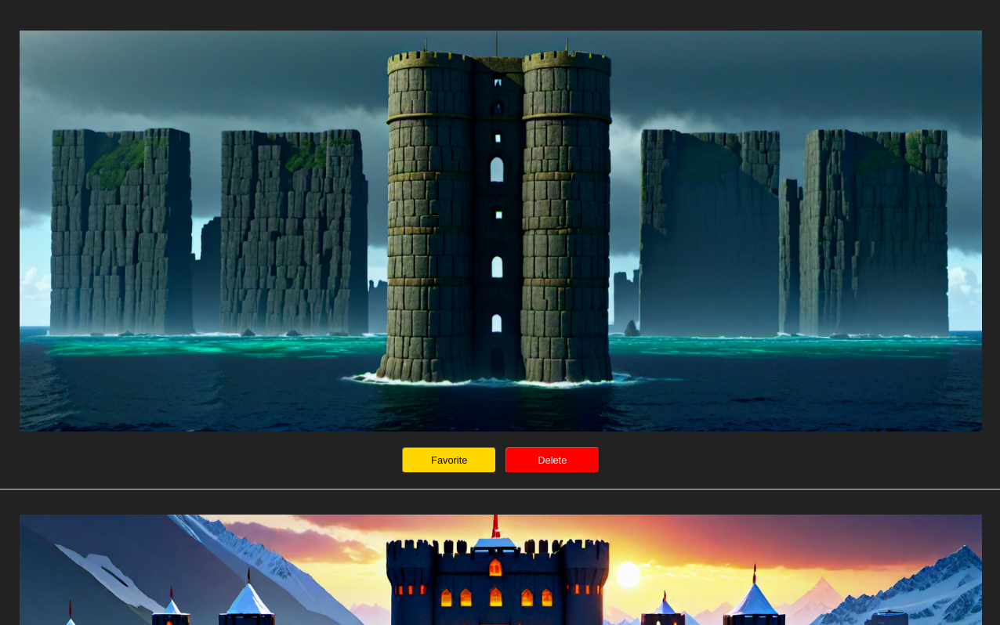

# ImageCurator
Favorite or delete images in a directory. Best when combined with stable diffusion outputs.



## Features

- **Interactive UI**: Quickly sift through images, marking your favorites and discarding the rest.
- **Flexible Source and Destination Paths**: Customize the source and destination directories for easier organization.
- **Support for Upscaled Images**: If you have upscaled versions of your images, ImageCurator can handle those too.
- **Easy Integration**: Built with Flask, ImageCurator is lightweight and can be easily integrated with other systems or workflows.

## Installation

1. Clone the repository:

```git clone https://github.com/mikkel/ImageCurator.git```

2. Navigate to the cloned directory:

```cd ImageCurator```

3. Install the required Python packages:

```pip install flask```

## Usage

To run ImageCurator:

```
python main.py [source_directory] [destination_directory] [upscale_source_directory(optional)] [upscale_destination_directory(optional)]
```

if the upscale directories are specified, the name of the file must be the same (e.g. img/1.png has img-upscale/1.png)

Arguments:
- `source_directory`: The directory containing the images you want to curate (default is the current working directory).
- `destination_directory`: The directory where the favorited images will be moved (default is "keep").
- `upscale_source_directory`: The directory containing upscaled versions of the images (optional).
- `upscale_destination_directory`: The directory where the favorited upscaled images will be moved (optional).

For example:

```python main.py ./generated_images ./curated_images```


Open your browser and navigate to `http://localhost:8666/` to start curating your images.

## Contributing

Contributions are welcome! If you have suggestions, bug reports, or enhancements, feel free to open an issue or submit a pull request.

## License

MIT License. See [LICENSE](./LICENSE) for more information.


